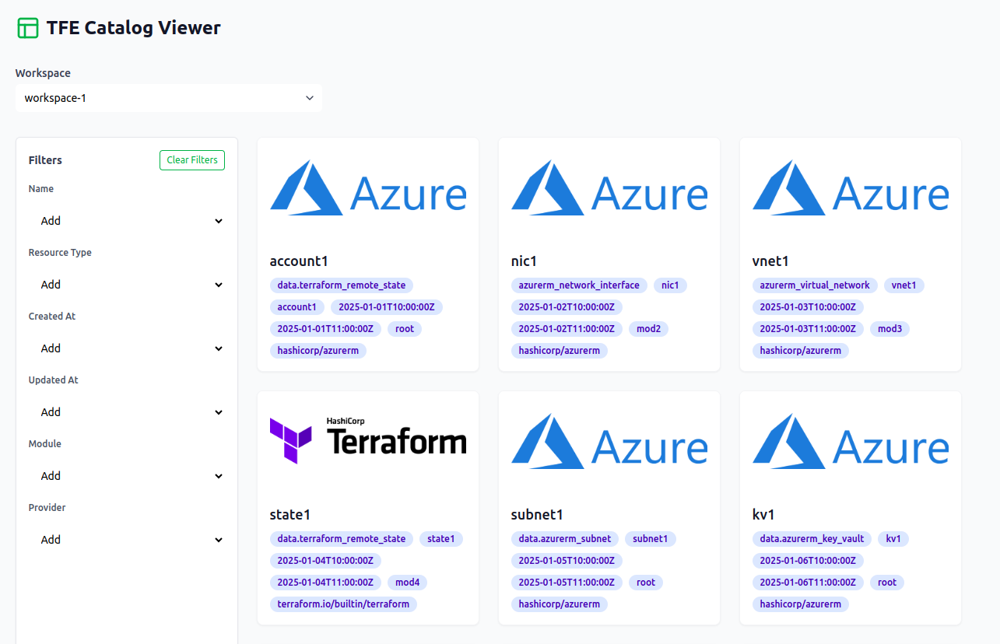

# TFE Catalog Viewer

This project is a **proof of concept (PoC)** application that consumes data from the Terraform Cloud (TFE) API and displays it in a visual, interactive resource catalog with filters. The project is split into two parts:

- **Backend**: A mock API built with FastAPI that simulates Terraform Cloud endpoints or optionally proxies requests to the real TFE API.
- **Frontend**: A React application with TailwindCSS that displays workspaces, resources, and dynamic filters with pagination and search.

This is especially useful for platform teams, DevOps engineers, or auditors who need to interact with TFE's resource data via API or are considering embedding this visibility into internal tools or custom platforms.




## 🔧 Technologies

- 🐍 **Backend**: FastAPI + Uvicorn
- ⚛️ **Frontend**: React + TypeScript + TailwindCSS
- 📦 Package Managers: `npm` and `venv`


## 📁 Project Structure

```bash
/
├── backend/                            # Backend FastAPI mock server and proxy
│   ├── proxy.py                        # Proxy server for forwarding requests to real TFE API (optional)
│   ├── main.py                         # Main FastAPI application (mock endpoints)
│   ├── data.json                       # JSON file with mocked data for workspaces and resources
│   ├── requirements.txt                # Python dependencies for running the FastAPI backend
│
├── frontend/                           # Frontend React application (Vite + TailwindCSS)
│   ├── public/                         # Static assets folder
│   │   └── images/                     # Provider icons used in the UI
│   │       ├── aws.png
│   │       ├── azure.png
│   │       ├── generic.png
│   │       └── terraform.png
│   │
│   ├── src/                            # Source code of the React app
│   │   ├── App.tsx                     # Main application logic (pagination, filters, resource viewer)
│   │   ├── index.css                   # Global styles (includes Tailwind)
│   │   ├── main.tsx                    # React app entry point
│   │   ├── types.ts                    # Shared TypeScript types
│   │   ├── vite-env.d.ts               # Type declarations
│   │   └── components/                 # UI components
│   │       ├── Dropdown.tsx            # (Unused now — replaced by Combobox)
│   │       ├── MultiSelect.tsx         # Sidebar filtering control
│   │       ├── ResourceCard.tsx        # Resource summary view
│   │       └── ResourceModal.tsx       # Resource detail popup
│   │
│   ├── tailwind.config.js              # TailwindCSS configuration
│   └── ...                             # Vite, tsconfig, etc.
│
└── README.md                           # Documentation and instructions
```

## ▶️ Running the project locally

### 1. Clone the repository

```bash
git clone https://github.com/your-username/tfe-catalog-viewer.git
cd tfe-catalog-viewer
```

### 2. Run the **backend (mock or proxy)**

> You can use either `main.py` (mock API) or `proxy.py` (to connect to real TFE API).

**Option 1**: Run with mock data
```bash
cd backend
python3 -m venv .venv
source .venv/bin/activate
pip install -r requirements.txt
uvicorn main:app --reload
```

**Option 2**: Run with real Terraform API via proxy
```bash
python proxy.py
```
> ⚠️ Configure your base URL in `proxy.py`.

---

### 3. Run the **frontend (React app)**

> Update the values for your ORGANIZATION NAME and TOKEN
```tsx
const AUTH_HEADER = { headers: { Authorization: 'Bearer {TFE_API_TOKEN}' } };
const TFE_ORGANIZATION = '{TFE_ORGANIZATION}'
```

```bash
cd frontend
npm install
npm run dev
```

App will be available at:  
🌐 `http://localhost:5173`


## ✅ Features

- 🔍 Workspace search with **type-ahead + debounce**
- 🧠 Intelligent filtering: name, provider, module, date, etc.
- 📄 Resource modal with full JSON metadata
- 📚 Paginated resource view (configurable)
- 💡 Responsive design with TailwindCSS
- 🔁 Proxy support for real Terraform Enterprise (TFE) API
- 🧪 Works great for PoCs, platform teams, audits, and more

## 🔁 Switching to the Real Terraform API

You can either use:
- `proxy.py` to forward all requests (preferred) to handle with CORS
- or directly update `App.tsx` fetch URLs to point to `https://app.terraform.io/api/v2` with your auth token

## 🧪 Testing the PoC

- The frontend communicates with the local mock API (`localhost:8000`).
- Select a workspace using the dropdown.
- Apply filters (provider, type, module, etc.).
- Click on a resource card to view its details in a modal.

## 📝 License

This project is for demonstration and learning purposes only. Feel free to explore or adapt it as needed.

## 🙌 Acknowledgments

- Terraform Cloud for a well-designed API.
- TailwindCSS and HeadlessUI for rapid prototyping.
- FastAPI for making mock APIs easy and robust.